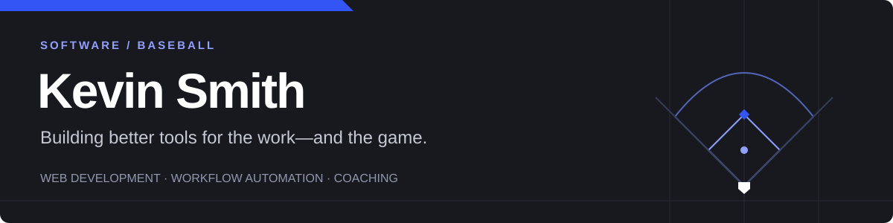

I build practical software for the people doing the work—whether that's a coach
in the dugout or a team managing a business workflow.

Coaching baseball shapes how I approach product development: make the important
information easy to see, keep the next action simple, and test it where it will
actually be used.

## What I'm building

### Chart-It · Baseball coaching software

A connected workspace for pitch charting, scouting, keeping score, and tracking
player performance. Built around fast input on phones and iPads.

- **Game day:** two-tap pitch entry, counts, plate appearances, runners, and a live scorebook.
- **Coaching:** pitch usage, count tendencies, opponent plans, and printable reports.
- **Player performance:** daily before/after weights and customizable lifting groups.
- **Team workflow:** a reusable roster, role-based access, and cloud saves.

Chart-It is in active development. The application source is private.

### Business tools & workflow automation

I also work on web tools that simplify repetitive tasks, organize data, and make
everyday operations easier to manage. My interests include forms, reporting,
data integrations, and replacing manual steps with clear, dependable workflows.

## How I work

**Start with the workflow.** Understand what someone needs to accomplish before
choosing the implementation.

**Reduce friction.** Fewer clicks, clear controls, and layouts that work on the
device in front of the user.

**Keep the data useful.** Capture it consistently so reports answer real questions.

## Tools I work with

JavaScript · PHP · HTML · CSS · SQL · Supabase · Firebase · Git

---

**Current focus:** building Chart-It for college baseball and improving the
connection between live game entry and coaching decisions.
